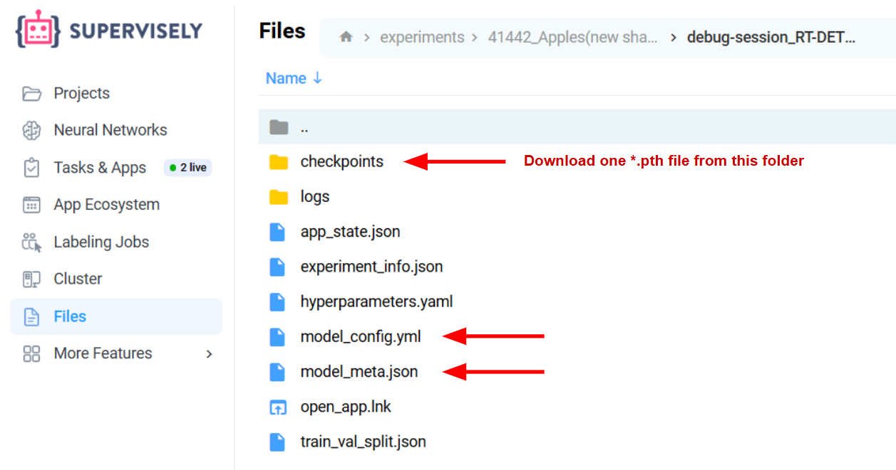

# How to use your checkpoints outside Supervisely Platform

After you've trained a model in Supervisely, you can download the checkpoint from Team Files and use it as a simple PyTorch model without Supervisely Platform.


**Quick start:**

1. Set up environment. Install [requirements] manually, or use our pre-built docker image [DockerHub](https://hub.docker.com/r/supervisely/rt-detrv2/tags). Clone [RT-DETRv2](https://github.com/supervisely-ecosystem/RT-DETRv2) repository with model implementation.
2. Download your checkpoint and model files from Supervisely Platform.
3. Run inference. Refer to our demo scripts: [demo_torch.py], [demo_onnx.py], [demo_trt.py]


## Step-by-step guide:

### 1. Set up environment

**Manual installation**

```bash
git clone https://github.com/supervisely-ecosystem/RT-DETRv2
cd RT-DETRv2
pip install -r rtdetrv2_pytorch/requirements.txt
```

**Using docker image (advanced)**

We provide a pre-built docker image with all dependencies installed [DockerHub](https://hub.docker.com/r/supervisely/rt-detrv2/tags). The image includes dependencies for PyTorch, ONNXRuntime, and TensorRT inference.

```bash
docker pull supervisely/rt-detrv2:1.0.2
```

See our [Dockerfile](https://github.com/supervisely-ecosystem/RT-DETRv2/blob/main/docker/Dockerfile) for more details.

Docker image does not include the source code. Clone the repository inside the container:

```bash
git clone https://github.com/supervisely-ecosystem/RT-DETRv2
```

### 2. Download checkpoint and model files from Supervisely Platform

For RT-DETRv2, you need to download the following files:
- `checkpoint.pth` - model weights, for example `best.pth`
- `model_config.yml` - model configuration
- `model_meta.json` - class names

Go to Team Files in Supervisely Platform and download the files:




### 3. Run inference

We provide several demo scripts to run inference with your checkpoint:

- [demo_torch.py] - simple PyTorch inference
- [demo_onnx.py] - ONNXRuntime inference
- [demo_trt.py] - TensorRT inference
